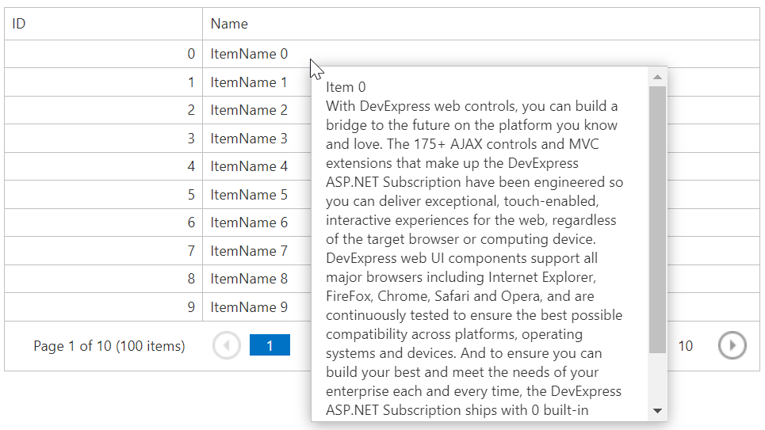

<!-- default badges list -->

[](https://supportcenter.devexpress.com/ticket/details/T342270)
[](https://docs.devexpress.com/GeneralInformation/403183)
<!-- default badges end -->
# Grid View for ASP.NET MVC - How to create a custom tooltip to display a long text string
<!-- run online -->
**[[Run Online]](https://codecentral.devexpress.com/128549888/)**
<!-- run online end -->

This example demonstrates how to use a popup control to display a custom tooltip.



## Overview

The main idea is to assign a delegate method to the grid's [HtmlDataCellPrepared](https://docs.devexpress.com/AspNetMvc/DevExpress.Web.Mvc.GridViewSettings.HtmlDataCellPrepared) property and handle the `mouseover` event to display a pop-up window.

```csharp
settings.HtmlDataCellPrepared = (s, e) => {
    e.Cell.Attributes.Add("onmouseover", String.Format("OnMouseMove(this, event, '{0}');", e.KeyValue));
};
```

```js
var oldKey = null;
function OnMouseMove(element, event, key) {
    if (typeof GridView.cpTooltipList[key] != "undefined" && oldKey != key) {
        oldKey = key;
        PopupControl.ShowAtPos(event.clientX, event.clientY);
        ToolTipLabel.SetText("Item " + key + "<br/>" + GridView.cpTooltipList[key]);
    }   
}
```

Use the grid's [CustomJSProperties](https://docs.devexpress.com/AspNetMvc/DevExpress.Web.Mvc.GridViewSettings.CustomJSProperties) property to get information about row values and pass it to the client.

```csharp
settings.CustomJSProperties = (s, e) => {
    MVCxGridView grid = s as MVCxGridView;
    int startIndex = grid.VisibleStartIndex;
    int endIndex = grid.VisibleStartIndex + grid.SettingsPager.PageSize;
    var clientData = new Dictionary<int, object>();
    for (int i = startIndex; i < endIndex; i++) {
        var rowValues = grid.GetRowValues(i, new string[] { "ID", "Description" }) as object[];
        clientData.Add(Convert.ToInt32(rowValues[0]), rowValues[1]);
    }
    e.Properties.Add("cpTooltipList", clientData);
};
```

## Files to Review

* [HomeController.cs](./CS/GridViewTooltip/Controllers/HomeController.cs) (VB: [HomeController.vb](./VB/GridViewTooltip/Controllers/HomeController.vb))
* [SimpleModel.cs](./CS/GridViewTooltip/Models/SimpleModel.cs) (VB: [SimpleModel.vb](./VB/GridViewTooltip/Models/SimpleModel.vb))
* [GridViewPartial.cshtml](./CS/GridViewTooltip/Views/Home/GridViewPartial.cshtml)
* [Index.cshtml](./CS/GridViewTooltip/Views/Home/Index.cshtml)

## Documentation

* [Passing Values Between Server and Client Sides](https://docs.devexpress.com/AspNetMvc/402316/common-features/client-side-functionality/passing-values-between-server-and-client-sides#how-to-access-server-data-on-the-client-side)
